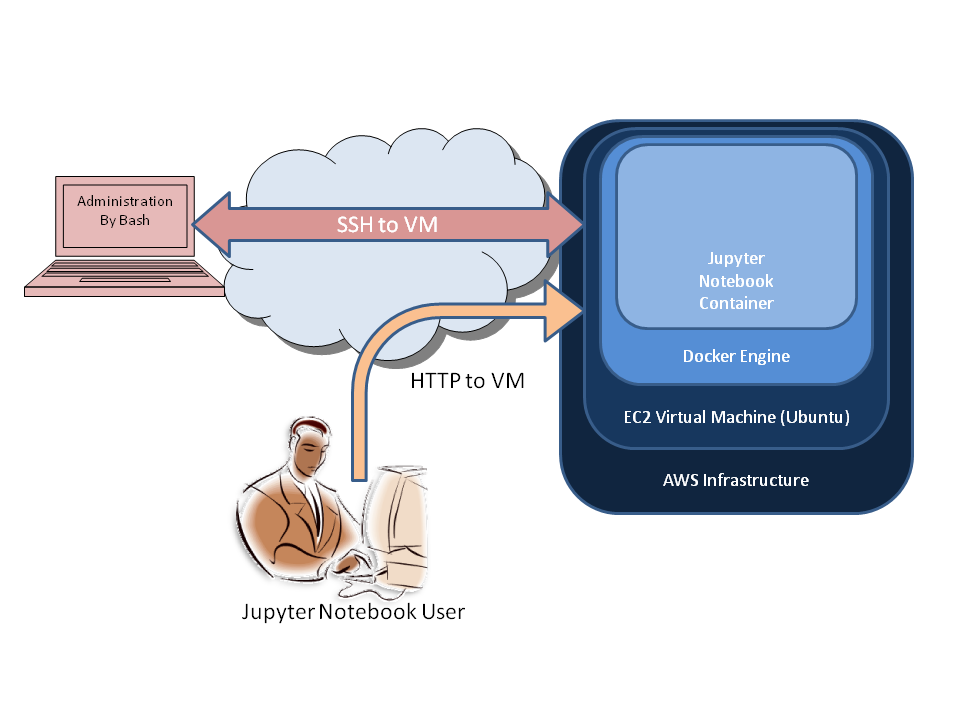

# Jupyter Notebook on Amazon Web Services #

## Overview ##

The purpose of this document is to outline the process of setting up a Jupyter Notebook on Amazon Web Services.

Jupyter Notebook is a web application platform which allows the creation of live documents that may contain components such as live code, equations, visualizations and text; in turn these documents may be viewed and shared securely over the internet.

Amazon Web Services (AWS) will be used as the underlying cloud computing services for this project, as it offers a reliable, scalable and inexpensive platform for deploying the solution.

We will also take advantage of the Docker container platform, to simplify the installation and maintenance of the Jupyter Notebook application.

Finally, we will be using Bash, a Unix Shell or command language interpreter, to run commands against the AWS platform. This is necessary for configuring and controlling the AWS server and Docker. We will establish the connection to AWS via a secure shell (SSH) connection from the local machine using Bash.

The diagram below shows the overall relationship in-between the components.

## Bash and SSH key ##
The first step is to utilize a local machine so that we can securely connect to AWS, in order to setup the environment. While Apple's OS has a built-in client, we need to install the Git Bash if we are using a Windows machine. This software can be downloaded and installed from the following URL: `https://git-scm.com`

### Creating the SSH private/public key ###
1) Run Bash on the local machine
2) At the command line type **`ssh-keygen`**
3) By default this will create and place the key pair under ~/.ssh
4) Leave the passphrase blank
5) The private/public key files will be created under ~/.ssh
	* id-rsa
	* id-rsa.pub
6) Type **`cat ~/.ssh/id_rsa.pub`** to view the contents of the public key file
7) The contents of this file will be used in step (6) of the next section

## Setting up the AWS virtual server ##
Next we need to sign-up and setup an AWS account, in order to create a virtual machine that will host the application and data throughout the project. Select region closest to your geographic location.

### I - Importing SSH Key Pair for connecting to the server from the local machine ###
1) Logon to your AWS account
2) Under the Sevices/Compute tab select Elastic Compute Cloud (EC2)
3) Select Key Pairs
4) On top click on Import Key Pair
5) Type a name for the Key pair name
6) Copy and paste the results from step (7) above into Public key contents
7) Click Import

### II - Setting-up the Security Group for accessing the server from the iternet ###
1) Logon to your AWS account
2) Under the Sevices/Compute tab select Elastic Compute Cloud (EC2)
3) Select Security Groups
4) On top click on Create Security Group
5) Type in a name and a description
6) Under Inbound click Add Rule and enter the following rules and select anywhere under Source
	* SSH
	* HTTP
	* Custom (Port 8888)
	* Custom (Port 2376)
	* Custom (Port 27016)
7) Click on Create

### III - Create an Instance using the SSH key and Security Group created ###
1) Logon to your AWS account
2) Under the Sevices/Compute tab select Elastic Compute Cloud (EC2)
3) Click Launch Instance
4) Select Ubuntu as the Amazon Machine Image (AMI)
5) Select t2.micro as the Instance Type
6) Leave the default settings under Configure Instance
7) Type 30 GiB for the size of the storage
8) Skip the Add Tags tab
9) Select an existing Security Group and select the one created in section II
10) Review the Instance settings and click Launch
11) Select the key pair created in section I and continue
12) On the EC2 dashboard select Running Instances and edit the name of the newly created instance
13) Note the public IP address xxx.xxx.xxx.xxx for connecting to this instance

	
## Docker ##
We are now ready to install Docker on the virtual AWS server. We use Bash on the local machine to connect via SSH to the newly created instance for setup and configuration.

### Setup and configure Docker ###
1) Run Bash on the local machine
2) At the command line type **`ssh ubuntu@xxx.xxx.xxx.xxx`** where xxx.xxx.xxx.xxx is the IP address obtained in step 13 above (Connect to your AWS instance)
3) Type **`curl -sSL https://get.docker.com | sh`** (Download and install docker by piping to shell - not the best security practice!)
4) Type **`sudo usermod -aG docker ubuntu`** (Add ubuntu user to the docker group)
5) Type Ctrl-D to disconnect for changes to take place
6) Re-connect by typing **`ssh ubuntu@xxx.xxx.xxx.xxx`**
7) Type **`docker -v`** (To verify a version of docker is running)

## Jupyter Notebook ##
Finally we are going to configure the Jupyter Notebook application in Docker.

### Setup and configure Jupyter Notebook ###
1) Run Bash on the local machine
2) At the command line type **`ssh ubuntu@xxx.xxx.xxx.xxx`** where xxx.xxx.xxx.xxx is the IP address obtained in step 13 above (Connect to your AWS instance)
3) Type **`docker pull jupyter/datascience-notebook`** (To pull the image)
4) Type **`docker run -v /home/ubuntu:/home/jovyan -p 80:8888 -d jupyter/datascience-notebook`** (This will run the Jupyter application, map the location of files, map external port 80 to internal port 8888 in a detached mode).
5) Type **`docker exec xxxx jupyter notebook list`** where xxxx is the first 4 characters of the container returned in step (4)
6) Open a browser and navigate to `http://xxx.xxx.xxx.xxx` the public IP address of the AWS instance
7) Copy the token returned in step (5) and paste into the browser to verify a successful configuration. This token is used as security measure to prevent un-authorized access to the Notebook

## Comparison of 3 different types of AWS instances ##
|Region|Type|vCPU|Memory (GiB)|Storage (GiB)|Usage Per Hour|Cost - Instance|Cost - Storage|Total Cost (90 days)|
|------|----|----|------------|-------------|--------------|---------------|--------------|--------------------|
|US West (Oregon)|t2.micro|1|1|50|$0.0116|$25.06|$15.00|$40.06|
|US West (Oregon)|t2.xlarge|4|16|100|$0.1856|$400.90|$30.00|$430.90|
|US West (Oregon)|p3.8xlarge|32|244|2000|$12.24|$26,438.40|$600.00|$27,038.40|
